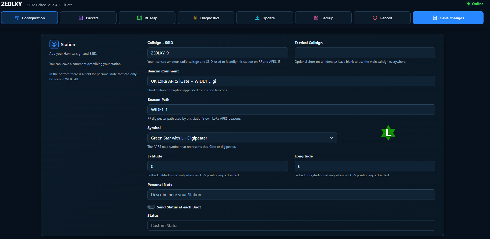
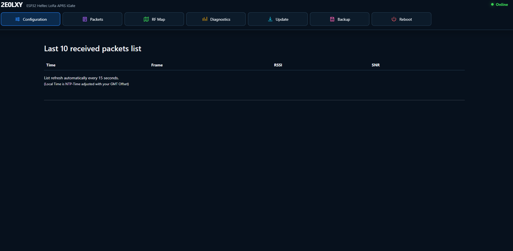
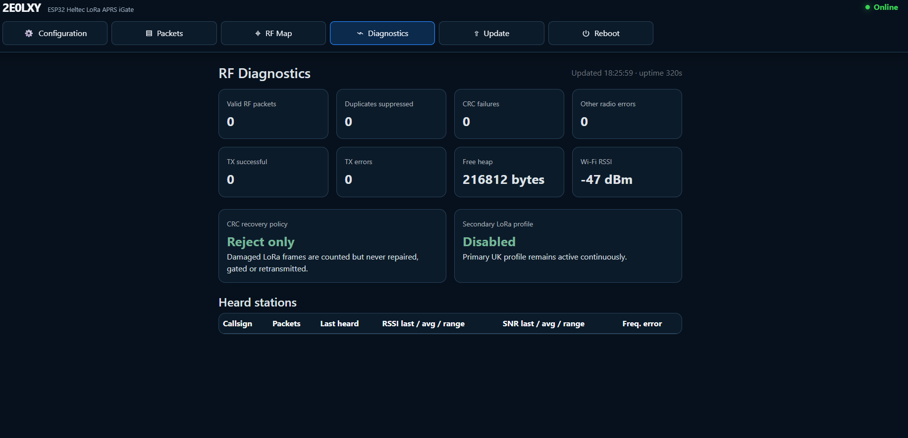

# 2E0LXY LoRa APRS iGate and Digipeater

Firmware for Heltec WiFi LoRa 32 V3.2, Heltec WiFi LoRa 32 V4 and LilyGO TTGO LoRa32 V2.1
boards operating as regional LoRa APRS iGates and configurable digipeaters.
The Heltec build also supports an external GPS-positioned station.

[Web installer](https://2e0lxy.github.io/2E0LXY-LoRa-APRS-iGate/) |
[Firmware downloads](https://github.com/2E0LXY/2E0LXY-LoRa-APRS-iGate/releases/latest) |
[Manual](docs/2E0LXY-LoRa-APRS-iGate-Manual.pdf) |
[APRS Net UK](https://www.aprsnet.uk/)

## Highlights

- Backward-compatible UK 439.9125 MHz and IARU Region 1 433.775 MHz
  presets, plus a locally coordinated custom profile.
- RF hardware-band/frequency validation, safe new-install defaults and
  explicit regional confirmation before transmission.
- Automatic named-timezone daylight saving and selectable display units.
- Simultaneous receive iGate and configurable WIDE1/WIDE2 digipeater.
- Board-specific OTA updates that refuse to install the other board's image.
- Heltec GPS location on GPIO 47 RX and GPIO 48 TX with automatic baud detection.
- Live GPS dashboard with hardware detection, fix quality, NMEA statistics,
  coordinates, altitude, speed, course and UTC time.
- APRS-IS gating through `www.aprsnet.uk:14580`.
- RF packet list and RF-only map with APRS position decoding.
- RF diagnostics, duplicate suppression and strict CRC rejection.
- Heard-station signal statistics: RSSI, SNR and frequency error.
- Wi-Fi scanner and multiple saved network profiles.
- GitHub release checking with confirmed one-click OTA installation.
- Web authentication, configuration backup/restore and remote controls.
- **APRS Net iGate Management**: telemetry, rolling 24-hour RF-heard history,
  remote restart, beacon and board-safe GitHub OTA via the member dashboard.
- Battery, external voltage, weather sensors, telemetry, MQTT, syslog
  and KISS/TNC bridge support.

## Install

The easiest installation method is the
[2E0LXY browser installer](https://2e0lxy.github.io/2E0LXY-LoRa-APRS-iGate/).
Use Chrome or Edge on a computer connected to one supported board by USB.
Select the exact Heltec generation because V3.2 and V4 are both ESP32-S3
boards but have different RF and flash hardware. LilyGO is detected as ESP32.

For manual installation, download one of the release assets:

- `2E0LXY-Heltec-V3.2-full-flash.bin` - first USB installation at `0x0`.
- `2E0LXY-Heltec-V3.2-firmware.bin` - OTA update that retains configuration.
- `2E0LXY-LilyGO-LoRa32-V2.1-full-flash.bin` - LilyGO first USB installation.
- `2E0LXY-LilyGO-LoRa32-V2.1-firmware.bin` - LilyGO OTA update.
- `2E0LXY-Heltec-V4-full-flash.bin` - Heltec V4 first USB installation.
- `2E0LXY-Heltec-V4-firmware.bin` - Heltec V4 OTA update.

Never cross-flash the V3.2, V4 and LilyGO OTA files. The in-device updater
selects the exact compatible asset automatically and stops if it is absent.

Back up the configuration before changing firmware and keep USB power
connected until installation completes.

## Regional configuration

| Profile | RX / TX starting point | APRS-IS | Notes |
| --- | --- | --- | --- |
| United Kingdom | `439912500` / `439912500` Hz | `www.aprsnet.uk` | Existing devices migrate without operational changes |
| IARU Region 1 common | `433775000` / `433775000` Hz | `rotate.aprs2.net` | Optional 433.900 MHz split must be locally coordinated |
| Custom | Operator supplied | Operator supplied | Required for other national or coordinated channel plans |

All presets use SF12, 125 kHz and CR 4/5 as a starting point. Modem settings
must match the local network. New installations begin with RF transmission
and digipeating disabled and use 10 dBm when a preset is applied. See
[Regional profiles](docs/REGIONAL-PROFILES.md).

GPS uses GPIO 47 RX / GPIO 48 TX on Heltec V3.2 and GPIO 38 RX / GPIO 39 TX
on Heltec V4, with automatic baud detection.

## APRS Net Remote Management

Devices running this firmware can connect to the APRS Net member dashboard
for live telemetry and remote control — no need to have physical access to
the device once it is deployed.

### Device setup (igate_conf.json)

Add the following to your `igate_conf.json` under the `mqtt` key:

```json
"mqtt": {
    "active":   true,
    "server":   "www.aprsnet.uk",
    "port":     1883,
    "topic":    "aprsnet",
    "username": "YOUR_CALLSIGN",
    "password": "YOUR_APRSNET_MEMBER_PASSWORD"
}
```

Replace `YOUR_CALLSIGN` and `YOUR_APRSNET_MEMBER_PASSWORD` with your
[aprsnet.uk](https://www.aprsnet.uk/) member account credentials.
You must have a registered account — sign up for free at the website.

### Dashboard

Once connected, open **Member Settings** on [aprsnet.uk](https://www.aprsnet.uk/)
(click your callsign → Settings). Scroll down to **📡 My LoRa APRS iGate Devices**.

Each device card shows in real time:

| Field | Description |
| --- | --- |
| Online / Offline | MQTT connection state |
| Last seen | Time since last telemetry packet |
| FW | Firmware version string |
| WiFi | WiFi signal strength (dBm) |
| Heap | Free heap memory on ESP32 |
| RX / TX | Packets received / transmitted since boot |
| Uptime | Time since last device restart |
| Hardware / position | Board model, LAN address and GPS or fixed position source |
| Region and radio | Country/profile, RX/TX frequency, modem settings, power, timezone and mismatch warning |
| Stations heard (24h) | First/last times, RF packets, RSSI, SNR, frequency error and distance in the selected unit |

### Remote commands

| Button | Action |
| --- | --- |
| ⟳ Restart | Reboots the ESP32 immediately |
| 📡 Force Beacon | Sends an APRS position beacon right now |
| ↻ Status | Requests an immediate telemetry update |
| ⇧ Update from GitHub | Downloads, validates and installs the latest firmware asset for that exact board |

Telemetry is also published automatically every **60 seconds**. The server
retains a bounded rolling 24-hour history across iGate restarts and provides a
CSV download for each device.

### Security

Each device authenticates with your member callsign and password.
All telemetry and commands are **private to your account** — no other
member can see or control your devices.

## Interface

### Configuration



### RF packets



### RF diagnostics



## Tracker interoperability audit

The following projects were reviewed as interoperability references:

- [aprs434/lora.tracker](https://github.com/aprs434/lora.tracker)
- [lora-aprs/LoRa_APRS_Tracker](https://github.com/lora-aprs/LoRa_APRS_Tracker)
- [dl9sau/TTGO-T-Beam-LoRa-APRS](https://github.com/dl9sau/TTGO-T-Beam-LoRa-APRS)

See the [full feature audit](docs/FEATURE-AUDIT.md) for the implementation
boundary and the safety rationale for excluded tracker-only or experimental
features.

| Reference capability | 2E0LXY iGate status |
| --- | --- |
| Standard LoRa APRS position packets | Supported |
| Base91-compressed APRS GPS positions | Supported through APRS packet processing |
| Independent RX/TX frequencies and LoRa parameters | Supported |
| GPS position, altitude and ambiguity | Supported for the iGate's beacon |
| Battery/external-voltage telemetry | Supported |
| Wi-Fi configuration and scanning | Supported |
| OLED timeout and power-saving operation | Supported |
| Manual and scheduled station beacon | Supported from the web interface |
| OTA firmware update | Supported, including GitHub release checking |
| Serial KISS/TNC and APRS bridge | Supported |
| APRS Net remote management (MQTT) | Supported — see above |
| Bluetooth KISS/TNC | Not present on this Heltec build; serial/network TNC is used |
| APRS434 experimental address-compressed 18-byte frames | Not advertised as supported |
| Tracker SmartBeaconing and turn detection | Tracker-only; not applicable to a fixed iGate |
| Tracker button/GPS power controls | Tracker-only; not applicable to a fixed iGate |

## Related 2E0LXY software

- [APRS Net UK](https://www.aprsnet.uk/) — live map, messaging, LoRa view,
  weather, iGate management, alerts and APRS utilities.
- [APRS Android](https://github.com/2E0LXY/APRS-Android)
- [APRS Client for Windows and Linux](https://github.com/2E0LXY/APRS-Client)
- [Advanced APRS Go Server](https://github.com/2E0LXY/Advanced-APRS-Go-server)

## Licence

Copyright © 2026 2E0LXY for original modifications and additions.

This modified work is distributed under the GNU General Public License
version 3 and is supplied without warranty. See [LICENSE](LICENSE).

Original contributor notices are retained in the source where required
by the GNU GPL.
